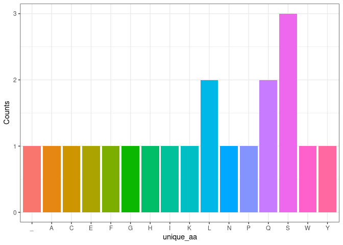

<!-- README.md is generated from README.Rmd. Please edit that file -->

# group12RPackage.Rproj

<!-- badges: start -->
<!-- badges: end -->

The goal of group12RPackage.Rproj is to …

## Installation

You can install the development version of group12RPackage.Rproj from
[GitHub](https://github.com/) with:

``` r
# install.packages("devtools")
devtools::install_github("rforbiodatascience22/group_12_package")
```

``` r
library(group12RPackage.Rproj)
```

### Link to GitHub

<https://github.com/rforbiodatascience22/group_12_package>

## Brief description

This package was developed as part of the 22100 course at DTU. It can be
used to perform tasks related to the Central Dogma of Biology
(i.e. transcription and translation) and plot the amino acid counts in a
protein.

## Demonstration of functionality

Creating a random DNA sequence for demonstration purposes

``` r
seq_length <- 60
r_DNA_seq <- random_seq(seq_length)
r_DNA_seq
#> [1] "GGGATTGAGTGTTATCAGTTCCCCAAATTAAGTCATTCACAATAGTGGAACTCCCTCGCA"
```

transcribing the seuqence to RNA

``` r
mRNA <- transcription(r_DNA_seq)
mRNA
#> [1] "GGGAUUGAGUGUUAUCAGUUCCCCAAAUUAAGUCAUUCACAAUAGUGGAACUCCCUCGCA"
```

extract codons from mRNA

``` r
codons <- get_codons(mRNA)
codons
#>  [1] "GGG" "AUU" "GAG" "UGU" "UAU" "CAG" "UUC" "CCC" "AAA" "UUA" "AGU" "CAU"
#> [13] "UCA" "CAA" "UAG" "UGG" "AAC" "UCC" "CUC" "GCA"
```

translate codons into protein sequence

``` r
protein_seq <- translation(codons)
protein_seq
#> [1] "GIECYQFPKLSHSQ_WNSLA"
```

Visualizing amino acid distribution in protein sequence

``` r
plot_aa(protein_seq)
```



## Discussion

We think it is a good idea to limit the number of dependencies a package
has because it makes it more robust to problems that arise within those
packages. Also, it is less probable that conflicts come up due to
updates in those packages.

The difference between adding an @importFrom package function tag to a
function description compared to using package::function() is that with
the first method you only import a specific function on the package,
whereas with the second method you import the whole package. Thus, the
first method is better when you only need a single function of a
specific package.

## Additional functions

We could potentially also create a function for Reverse Transcription.
To produce a DNA sequence from RNA.

reverse_transcription \<- function(RNA_seq) { DNA_seq \<- gsub(“U”, “T”,
RNA_seq) return(DNA_seq) }

To use with package with DNA sequences and get the exact protein
sequence, we could create a function that recognizes the ‘Start’ and
‘Stop’ codons and then proceed with transcription to produce the exact
protein sequence.
